# 用上了 Claude Code,才发现 Cursor 和 Gemini Cli 都是弱 智。。(保姆级安装和使用教程分享)

原创 R哥 [AI技术宅](javascript:void(0);) 2025年07月03日 11:30 广东

关注公众号, AI技术干货及时送达!

AI技术宅

专注分享 AI 大模型、AI 应用实践、AI 工具、AI 编程、AI 最新资讯和玩法、DeepSeek … 18篇原创内容

公众号

上一篇: [年度爆款!全球最火的 AI 编程工具合集](https://mp.weixin.qq.com/s?__biz=MzU0OTc0NzAxMg==&mid=2247485402&idx=1&sn=d1bf7202013458638bb56f7ced58a1cc&scene=21#wechat_redirect)

大家好,我是R哥。

话说, 前段时间一直用的 Cursor 辅助写代码, 最近 Gemini Cli 和 Claude Code 很火, 我都 体验了下, 说说我的感受, 发现 Claude Code 是真强。

Gemini Cli 体验了下, 和智障没区别, 简直就是一个半成品, 和 Cursor 都没法比, 不知道是不 是个人免费版的原因,总之效果太差,直接卸载。

Claude Code 是我用过的最牛逼的 AI 编程工具,没有之一,**用上了 Claude Code,才发现 Cursor 也是弱智**, UI 和收费模式整天改来改去, 降智, 速度也是越来越慢。。

Claude Code 是由 Anthropic 开发的可在本地运行的自动化 AI 编程工具,可以在任意终端上运 行,在任意 IDE 中使用,能理解**代码库、执行命令、自动化管理 Git 仓库,调用 MCP** 等等。

官网: https://www.anthropic.com/claude-code

这篇我就从安装、配置、快速使用、开发实战,来演示下 Claude Code 的强大。

**安装 Claude Code**

Claude Code 需要依赖 NodeJS 18+:

https://nodejs.org/en/download/current

安装好 NodeJS 后然后再安装 Claude Code:

npm install -g @anthropic-ai/claude-code

检查是否安装成功:

claude --version

成功安装会显示版本号。

# **配置 Claude Code**

安装 Claude Code 后, 在你的项目目录, 或者任意目录再输入 claude 运行:

claude

首次进入需要配置 Claude Code 主题及登录方式:

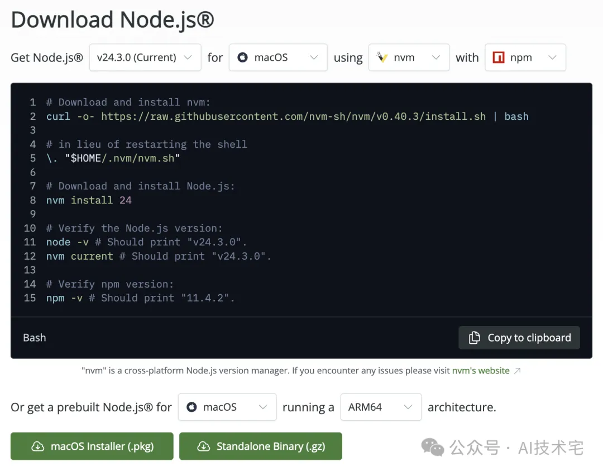

使用上下方向键选择主题,然后按回车键确认即可,后续可以通过 /config 命令调整。

目前, Claude Code 无法直接在 Windows 上运行, 需要借助 WSL, Windows 用户请查看官方 文档。

### 然后开始选择登录方式:

| * Welcome to Claude Code                                                                                                 |                      |
|--------------------------------------------------------------------------------------------------------------------------|----------------------|
| . . - 7                                                                                                               |                      |
| Claude Code can now be used with your Claude subscription or billed based on API usage through your Console account.     |                      |
| Select login method:                                                                                                     |                      |
| > 1. Claude account with subscription Starting at \$20/mo for Pro, \$100/mo for Max - Best value, predictable pricing |                      |
| 2. Anthropic Console account API usage billing                                                                        | <b>‰</b> 公众号 · Al技术宅 |

使用上下键选择登录方法:

- 1、Claude account with subscription: 使用 Claude 订阅账户, Pro 版本 20 美元/月, Max 版本 100 美元/月——性价比最高,价格稳定可预测。
- **2、Anthropic Console account**:使用 Anthropic 控制台账户,根据 API 使用计算费用。

#### 常用的就是第一种方案:

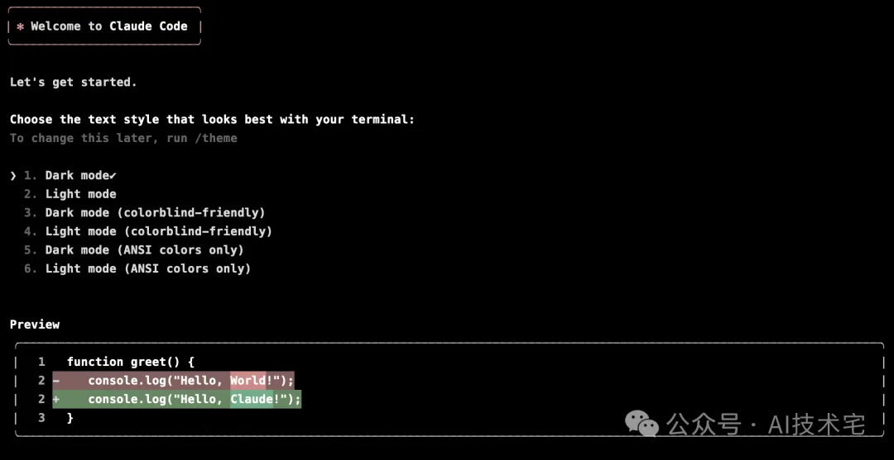

其实就是 Claude 的 Web 端会员, 现在支持在 Claude Code 中使用了, 之前只支持 Max 版 本,现在已经下放到 Pro 会员了。

免费版只有简单的功能,无法在 IDE 或者终端中使用, 所以要使用 Claude Code, 必须要订阅 Pro 及以上会员。

付费必须是国外信用卡。

这是市面上最主流的解决方案。

**开始使用 Claude Code**

### **快速开始**

使用 claude 命令进入项目后,就可以使用 Claude Code 了。

可以使用 /init 命令,生成一个 CLAUDE.md 项目指南文件。

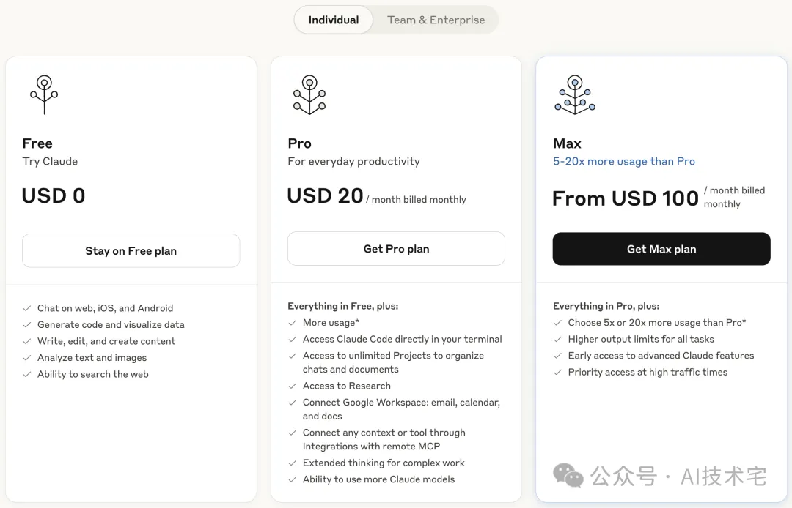

完后后写入 CLAUDE.md 记忆文件,可以通过上下方向键选择是否直接编辑文件不再询问授权。

#### **你也可以先问它一些项目上的问题:**

- 这个项目是干什么的?
- 总结一下这个项目的功能
- 这个项目使用了哪些技术栈?
- 这个项目的首页在哪里?
- 解释一下这个文件夹结构
- $\bullet$ ....

演示第一个问题:

Claude Code 会根据需要自行读取文件,你不用手动添加任何上下文信息,省事多了!

## **常用命令**

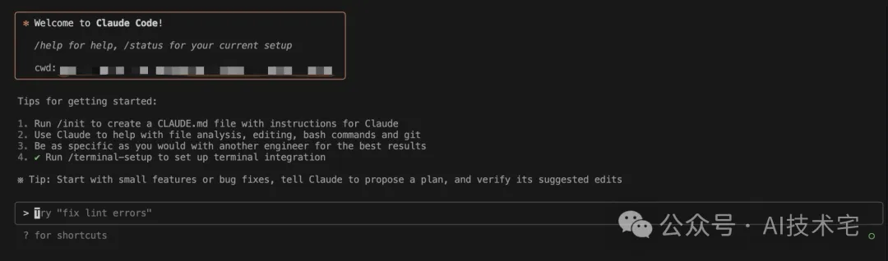

Claude Code 常用命令如下表:

| 命令                       | 功能说明              | 示例                   |
|--------------------------|-------------------|----------------------|
| claude                   | 启动交互模式            |                      |
| claude "任务"              | 执行一次性任务           | claude "修复这个编译错误"    |
| claude -p "查询"           | 扫行一次命令后退出         | claude -p "解释一下这个方法" |
| $claude -c$              | 继续上一次对话           |                      |
| $claude -r$              | 继续之前的对话           |                      |
| claude commit            | 创建一个 Git 提交       |                      |
| $\ell$ clear             | 清除对话历史            |                      |
| $/$ help                 | 显示可用命令            |                      |
| exit $\vec{p}$ Ctrl+C | 退出 Claude Code 模式 |                      |

### **优化你的终端设置**

### **换行符**

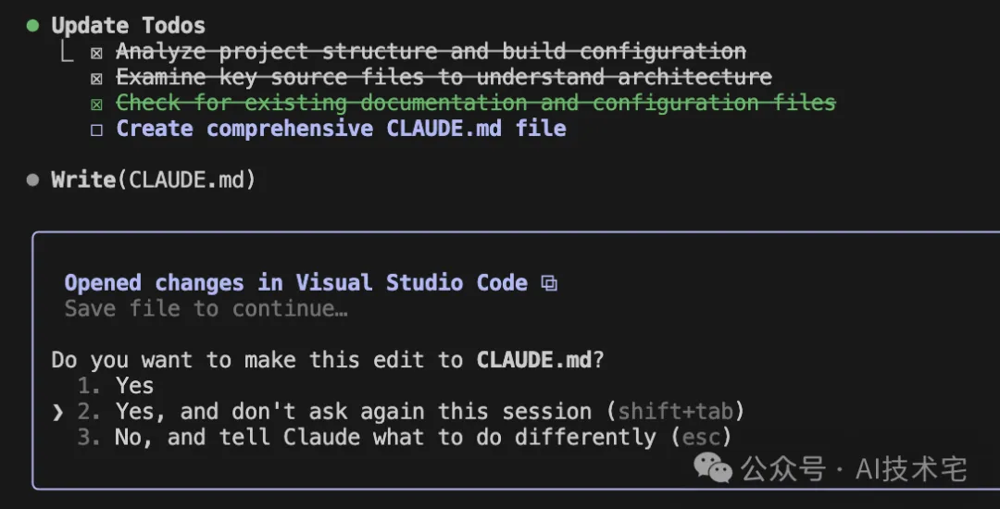

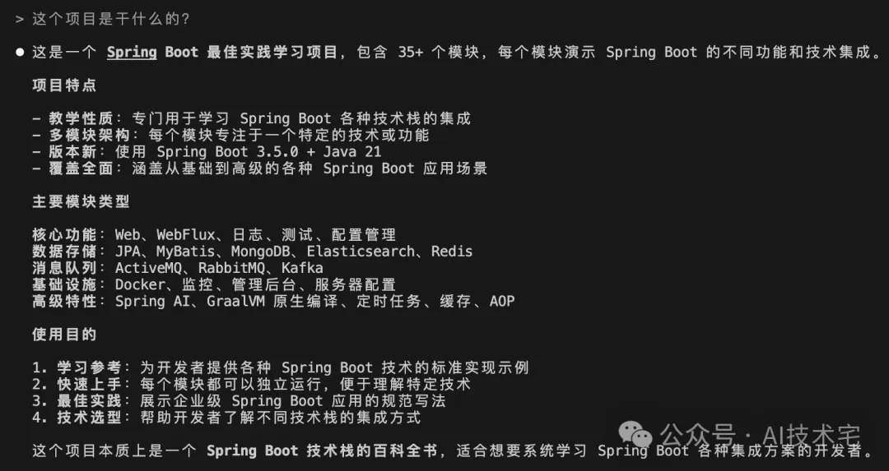

在 Claude Code 里,你有好几种方法可以输入换行符:

- 小技巧: 输入 \ 然后按回车键, 就能快速换行啦!
- 快捷键:配置正确后,按下 Option+Enter 键进行换行。

第二种快捷键,需要在终端设置描述文件中选中 "**将 Option 键用作 Meta**" 键:

| $\odot$ $\sim$ 默认                     | 当备用屏幕显示时,发送输入内容而不是滚动终端视图; 按下Fn或 Shift键来滚动视图 士 六? 二             |
|------------------------------------------|----------------------------------------------------------------|
| ETT <b>Solid Colors</b> Terminal v | √ 将Option键用作Meta键 √ 滚动备用屏幕                                  |
|                                          | - 编辑 $^{+}$                                                 |
| Silver Aerogel                           | $1033[25-$ F5 $\Diamond$ 100000 $\Gamma \cap \Lambda$ |
|                                          | $1033[34-$ F20                                              |
| <b>Red Sands</b>                         | $1033[33-$ F19                                              |
|                                          | $1033[32-$ F18                                              |
| 默认                                       | $1033[31-$ F17                                              |
| Pro $\frac{\text{max}}{\text{max}}$   | $1033[29-$ F16                                              |
|                                          | $1 - - - 1 - -$ 1.1.1 $1033[28-$ F15                  |

如果使用的是 **iTerm2**, 它也有类似的设置。

### **通知设置**

配置好通知,**任务完成时就会有声音提醒**,配置方式:

claude config set --global preferredNotifChannel terminal\_bell

注意, 还需要把对应终端的通知权限打开才行。

### **处理大量输入**

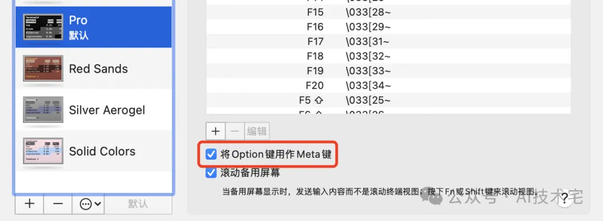

处理大量代码或长指令时注意以下事项:

- 1、尽量避免直接粘贴,Claude Code 可能不太擅长处理过长的粘贴内容。
- 2、试试基于文件的工作流,把内容写到文件里,然后让 Claude 去读它。
- 3、注意 VS Code 的限制, VS Code 的终端特别容易截断长段的粘贴内容。

### **VIM 模式**

Claude Code 支持一部分 Vim 的快捷键,可以通过 /vim 启用或者通过 /config 进行自定义 设置。

目前支持的功能子集包括:

- 模式切换: Esc (切换到普通模式), i / ェ , a / д , o / o (切换到插入模 式)。
- 导航: h / j / k / l , w / e / b , 0 / \$ / ^ , gg / G 。
- 编辑: x , dw / de / db / dd / D , cw / ce / cb / cc / C , . (重复)。

# **与主流 IDE 集成**

Claude Code 能无缝集成常用的 IDE 开发工具,让你的编程流程更高效。

目前支持以下两种 IDE:

- **Visual Studio Code**:包括像 Cursor 和 Windsurf 这种分支在内的 Visual Studio Code, 直接在终端输入 claude, 插件就会自动安装。
- JetBrains IDEs: JetBrains 旗下的如 IntelliJ、PyCharm、WebStorm 等都可以用, 直接在 终端输入 claude , 插件也会自动安装, 或者也可以从插件市场中搜索安装, 然后重启一下 就搞定了。

除了在终端输入 claude 命令运行之外,还可以按快捷键 Commad + ESC 快速打开 Claude 面 板。

两种集成方式都支持 Claude Code 的配置系统, 要开启针对特定 IDE 的功能, 使用 /confi g 命令配置, 把差异工具设为 auto, 让 IDE 自动识别, Claude Code 会根据你使用的代码编 辑器自动选择合适的查看器。

如果你使用的是外部终端,不是 IDE 自带的终端,**在 IDE 中同一个工作目录启动 Claude Code 后**,你还可以在终端上通过输入 /ide 命令来连接 IDE, 如图所示:

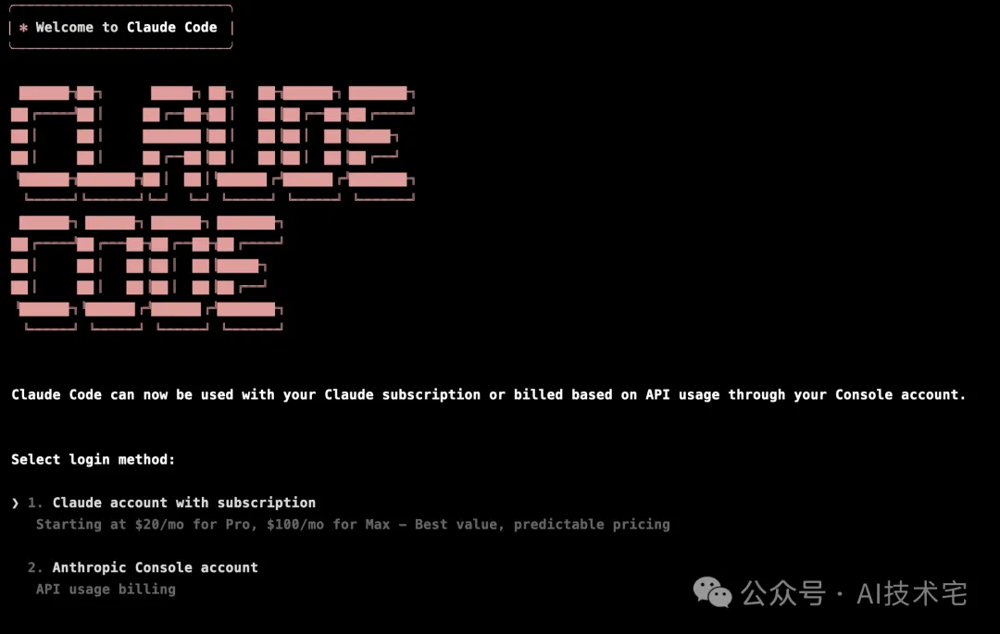

连接成功后,右下角会出现一个绿色的小圆圈,这样,就算你在单独的终端中运行 Claude Code,终端也可以和 IDE 协同工作。

## **开发实战**

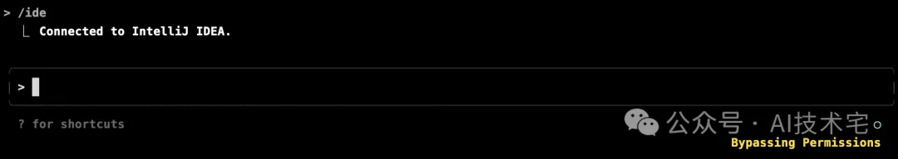

打开 VS Code, 现在我来让它来添加一个功能:

mybatis-plus 模块添加一个新增用户的接口

2025/7/15 05:08 用上了 Claude Code,才发现 Cursor 和 Gemini Cli 都是弱智。。(保姆级安装和使用教程分享)

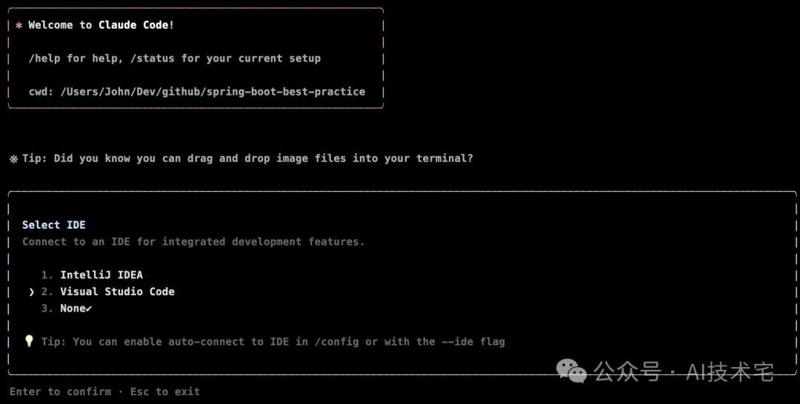

它会找到对应的文件,并给你展示修改内容,然后请示你的修改同意,同意后,它就会自动修改 文件,**如选择第 2 项,本次会话不再询问**,自动修改文件。

另外,如要**执行命令**也是一样的先询问后操作,然后再选择对应的授权选项即可。

等一会儿,它就完成了所有代码:

2025/7/15 05:08 

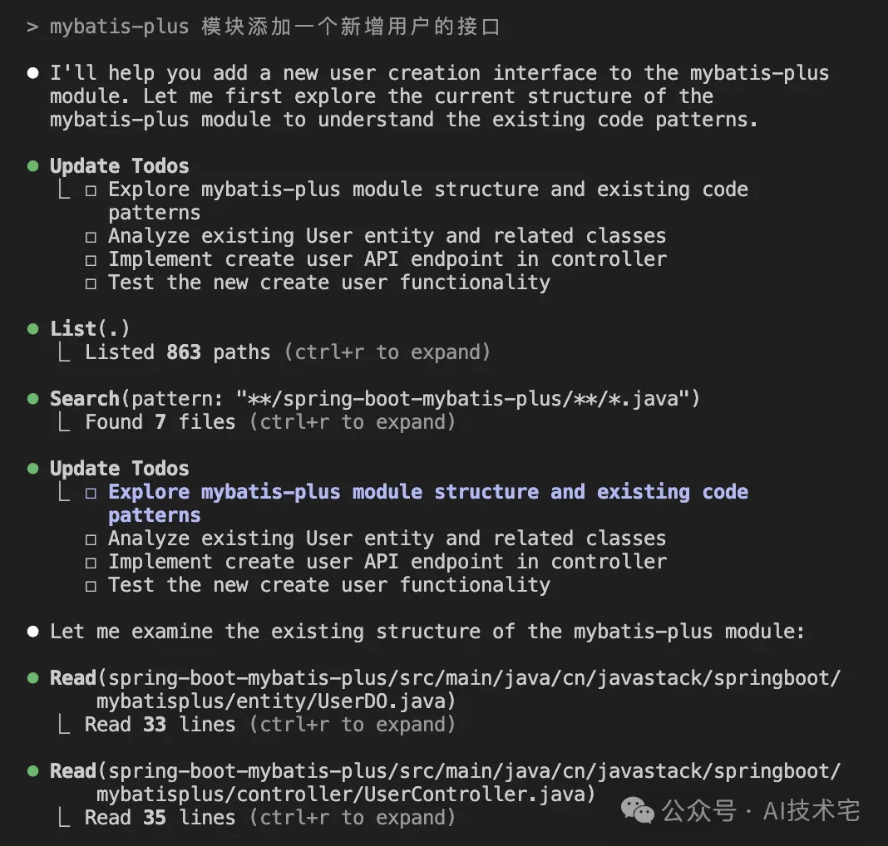

上面用的 VS Code,下面再切换到 **IntelliJ IDEA** 试下效果:

mybatis-plus 模块请添加一个页面用添加用户吧,再添加一个页面用来搜索用户

| $+ 0 0 1 1$ Project $\vee$                                                               | Application.java                                                                                                                                                                                                                                                                                                                          |                                                                                                                                                                                                                                                                                                                                                 |                                                                                                                                                                                                                                                                                                |                                                                                               | Δ                                                                                                                                                                                                                                                                                                                                                                                                                       |
|---------------------------------------------------------------------------------------------|-------------------------------------------------------------------------------------------------------------------------------------------------------------------------------------------------------------------------------------------------------------------------------------------------------------------------------------------|-------------------------------------------------------------------------------------------------------------------------------------------------------------------------------------------------------------------------------------------------------------------------------------------------------------------------------------------------|------------------------------------------------------------------------------------------------------------------------------------------------------------------------------------------------------------------------------------------------------------------------------------------------|-----------------------------------------------------------------------------------------------|-------------------------------------------------------------------------------------------------------------------------------------------------------------------------------------------------------------------------------------------------------------------------------------------------------------------------------------------------------------------------------------------------------------------------|
| <b>Ca</b> spring-boot-kafka                                                                 | P Side-by-side viewer $\sqrt{*}$ Do not ignore -                                                                                                                                                                                                                                                                                    |                                                                                                                                                                                                                                                                                                                                                 |                                                                                                                                                                                                                                                                                                |                                                                                               |                                                                                                                                                                                                                                                                                                                                                                                                                         |
|                                                                                             |                                                                                                                                                                                                                                                                                                                                           |                                                                                                                                                                                                                                                                                                                                                 | Proposed                                                                                                                                                                                                                                                                                       |                                                                                               |                                                                                                                                                                                                                                                                                                                                                                                                                         |
|                                                                                             |                                                                                                                                                                                                                                                                                                                                           | 39                                                                                                                                                                                                                                                                                                                                              |                                                                                                                                                                                                                                                                                                |                                                                                               |                                                                                                                                                                                                                                                                                                                                                                                                                         |
|                                                                                             |                                                                                                                                                                                                                                                                                                                                           |                                                                                                                                                                                                                                                                                                                                                 |                                                                                                                                                                                                                                                                                                |                                                                                               | $\mathsf{m}$                                                                                                                                                                                                                                                                                                                                                                                                            |
|                                                                                             |                                                                                                                                                                                                                                                                                                                                           |                                                                                                                                                                                                                                                                                                                                                 |                                                                                                                                                                                                                                                                                                |                                                                                               | 石子                                                                                                                                                                                                                                                                                                                                                                                                                      |
|                                                                                             |                                                                                                                                                                                                                                                                                                                                           |                                                                                                                                                                                                                                                                                                                                                 |                                                                                                                                                                                                                                                                                                |                                                                                               |                                                                                                                                                                                                                                                                                                                                                                                                                         |
|                                                                                             |                                                                                                                                                                                                                                                                                                                                           |                                                                                                                                                                                                                                                                                                                                                 |                                                                                                                                                                                                                                                                                                |                                                                                               | ø                                                                                                                                                                                                                                                                                                                                                                                                                       |
|                                                                                             |                                                                                                                                                                                                                                                                                                                                           |                                                                                                                                                                                                                                                                                                                                                 |                                                                                                                                                                                                                                                                                                |                                                                                               |                                                                                                                                                                                                                                                                                                                                                                                                                         |
| $\vee$ $\Box$ main                                                                          |                                                                                                                                                                                                                                                                                                                                           |                                                                                                                                                                                                                                                                                                                                                 |                                                                                                                                                                                                                                                                                                |                                                                                               |                                                                                                                                                                                                                                                                                                                                                                                                                         |
| $\vee$ $\Box$ java                                                                          |                                                                                                                                                                                                                                                                                                                                           |                                                                                                                                                                                                                                                                                                                                                 |                                                                                                                                                                                                                                                                                                |                                                                                               |                                                                                                                                                                                                                                                                                                                                                                                                                         |
|                                                                                             |                                                                                                                                                                                                                                                                                                                                           | '68                                                                                                                                                                                                                                                                                                                                             |                                                                                                                                                                                                                                                                                                |                                                                                               |                                                                                                                                                                                                                                                                                                                                                                                                                         |
| $\geq$ $\blacksquare$ config                                                                |                                                                                                                                                                                                                                                                                                                                           |                                                                                                                                                                                                                                                                                                                                                 |                                                                                                                                                                                                                                                                                                |                                                                                               |                                                                                                                                                                                                                                                                                                                                                                                                                         |
| $\vee$ $\Box$ controller                                                                    |                                                                                                                                                                                                                                                                                                                                           |                                                                                                                                                                                                                                                                                                                                                 |                                                                                                                                                                                                                                                                                                |                                                                                               |                                                                                                                                                                                                                                                                                                                                                                                                                         |
| C UserController                                                                            |                                                                                                                                                                                                                                                                                                                                           |                                                                                                                                                                                                                                                                                                                                                 |                                                                                                                                                                                                                                                                                                |                                                                                               |                                                                                                                                                                                                                                                                                                                                                                                                                         |
| Claude Code $\times$ + $\times$ <b>Terminal</b>                                          |                                                                                                                                                                                                                                                                                                                                           |                                                                                                                                                                                                                                                                                                                                                 |                                                                                                                                                                                                                                                                                                |                                                                                               |                                                                                                                                                                                                                                                                                                                                                                                                                         |
| □ 添加 Thymeleaf 依赖到 pom.xml □ 创建用户搜索页面 (search-user.html) □ 在 UserController 中添加页面映射方法 |                                                                                                                                                                                                                                                                                                                                           |                                                                                                                                                                                                                                                                                                                                                 |                                                                                                                                                                                                                                                                                                |                                                                                               |                                                                                                                                                                                                                                                                                                                                                                                                                         |
| Opened changes in IntelliJ IDEA @ Do you want to make this edit to pom.xml? 1. Yes    |                                                                                                                                                                                                                                                                                                                                           |                                                                                                                                                                                                                                                                                                                                                 |                                                                                                                                                                                                                                                                                                |                                                                                               |                                                                                                                                                                                                                                                                                                                                                                                                                         |
|                                                                                             | > Caspring-boot-knife4j $\angle$ $\Box$ spring-boot-logging $\triangleright$ $\Box$ spring-boot-mail $\sum$ spring-boot-mapstruct $\sum$ spring-boot-mongodb > <b>E</b> spring-boot-mybatis $\vee$ $\Box$ spring-boot-mybatis-plus $\vee$ $\Box$ src · Update Todos . Update(spring-boot-mybatis-plus/pom.xml) | $\tilde{\phantom{a}}$ --> <dependency> <groupid>com.mysql</groupid> </dependency>  > @ cn.javastack.springboot.mybatisplus L = 分析现有的 UserController 和相关代码结构 □ 创建 templates 目录和用户添加页面 (add-user.html) > 2. Yes, and don't ask again this session (shift+tab) 3. No, and tell Claude what to do differently (esc) | © UserController.java Highlight words $\sim$ △ Original: /Users/John/Dev/github/spring-boot-best-practice/spring-boot-my <version>\${mybatis-spring.version}边目 67.41 42 <artifactid>mysql-connector-j</artifactid> 63 32.45 <math>-66</math> 47</version> | 39 49 $-16$ 42 43 44 $-44$ 45 ® $\times$ Reject $\checkmark$ Apply | $X$ the $X$ $\checkmark$ ? 1 difference 2 <version>\${mybatis-spring.version}</version> 0 --> <dependency> <groupid>com.mysql</groupid> <artifactid>mysql-connector-j</artifactid> </dependency> <dependency> <groupid>org.springframework.boot</groupid> <artifactid>spring-boot-starter-thymeleaf<!--<br--></artifactid></dependency> <i><b>Identifiand</b></i> ❤ 公众号 · Al技: |

在 IntelliJ IDEA 插件市场中有专用的 Claude Code 插件,所有 UI 效果也更好,Java 开发还是 首先 IntelliJ IDEA 吧, 没有之一。

等一会儿,它就自动完成了:

| ● 已完成为 mybatis-plus 模块添加用户添加页面和用户搜索页面!                                                                                            |
|-----------------------------------------------------------------------------------------------------------------------------------|
| 添加的功能:                                                                                                                            |
| 1. 用户添加页面 (/add-user): - 表单包含用户名、手机号、状态字段 - 使用 AJAX 提交数据到现有的 /users API - 包含表单验证和错误处理 2. 用户搜索页面 (/search-user):       |
| - 支持按用户ID搜索 - 支持按用户名和类型搜索 - 展示完整的用户信息卡片 - 包含错误处理和无结果提示                                                                   |
| 3. 控制器更新: - 修改为 @Controller 以支持页面渲染 - 添加页面映射方法 /add-user 和 /search-user - 保持原有 API 端点功能, 添加 @ResponseBody 注解 4. 依赖添加: |
| - 在 pom.xml 中添加了 spring-boot-starter-thymeleaf 依赖                                                                                 |
| 现在可以通过以下URL访问: - 添加用户页面: http://localhost:8080/add-user - 搜索用户页面: http://localhost:8080/search-user                         |
| 两 个 页 面 都 有 现 代 化 的 响 应 式 设 计 , 包 含 导 航 链 接 可 以 <u>在</u> 页 面 间 切 换 <b>[技术宅</b>                                                 |

启动项目,访问添加用户页面 URL:

| 搜索用户 添加用户     |             |
|------------------|-------------|
| 用户名:             |             |
| 手机号:             |             |
| 状态:              |             |
| 激活 重置 添加用户 | $\check{~}$ |
|                  |             |
|                  | A公众号·AI技术宅  |
|                  |             |

效果还不错,来测试一下新增用户和查询用户:

| $C$ $\Omega$ O localhost:8080/add-user $\leftarrow$ $\rightarrow$ |             |                                      |       |                                                  | ☆ |
|----------------------------------------------------------------------------|-------------|--------------------------------------|-------|--------------------------------------------------|---|
|                                                                            |             | localhost:8080 显示 用户添加成功! 用户ID: 9 | 确定    |                                                  |   |
|                                                                            |             | 添加用户                                 |       |                                                  |   |
|                                                                            | 用户名:        |                                      |       |                                                  |   |
|                                                                            | iboy        |                                      |       |                                                  |   |
|                                                                            | 手机号:        |                                      |       |                                                  |   |
|                                                                            | 13001138888 |                                      |       |                                                  |   |
|                                                                            | 状态:         |                                      |       |                                                  |   |
|                                                                            | 激活          |                                      |       |                                                  |   |
|                                                                            | 添加用户 重置  |                                      |       | <b>  a&gt;         AI技术宅</b> |   |
|                                                                            |             |                                      |       |                                                  |   |
|                                                                            |             |                                      |       |                                                  |   |
|                                                                            |             | 添加用户                                 |       |                                                  |   |
|                                                                            |             | 搜索用户                                 |       |                                                  |   |
|                                                                            |             |                                      |       |                                                  |   |
| 用户ID:                                                                      | 用户名:        |                                      | 用户类型: |                                                  |   |
| 输入用户ID                                                                     | iboy        |                                      | 普通用户  |                                                  |   |
|                                                                            |             | 按用户名搜索 按ID搜索                      |       |                                                  |   |
| 搜索结果                                                                       |             |                                      |       |                                                  |   |
| 用户ID                                                                       | 用户名         | 手机号                                  | 状态    |                                                  |   |
| $\mathsf g$ 创建时间                                                        | iboy        | 13001138888                          | 激活    |                                                  |   |
| 2025-07-01T15:13:55                                                        |             |                                      |       |                                                  |   |
|                                                                            |             |                                      |       | A公众号· Al技术宅                                      |   |

相当完美,编译正常、运行正常、功能正常,Claude Code 给我的体验真是震撼!

### **总结**

Claude Code 的表现让我惊艳,它不仅是对传统 AI 编程工具的补全,更可以说是一次质的飞 跃,相比于 Cursor 等同类产品,Claude Code 在**交互体验、响应速度、稳定性乃至订阅模式**上 都表现得更加成熟和理性。

如果说 Cursor 是你的开发搭子,那 Claude Code 就更像是一个**懂代码、懂上下文、懂需求、 还能动手的高级程序员**,对于追求效率的程序员,Claude Code 无疑是目前最值得入手的 AI 开 发工具之一。

我这个懂一点三脚猫的前端技术的后端程度员,也能写出精致的前端页面,相对壁垒更高的后端 来说,**前端程序员,真的危矣!**

### 参考文档:

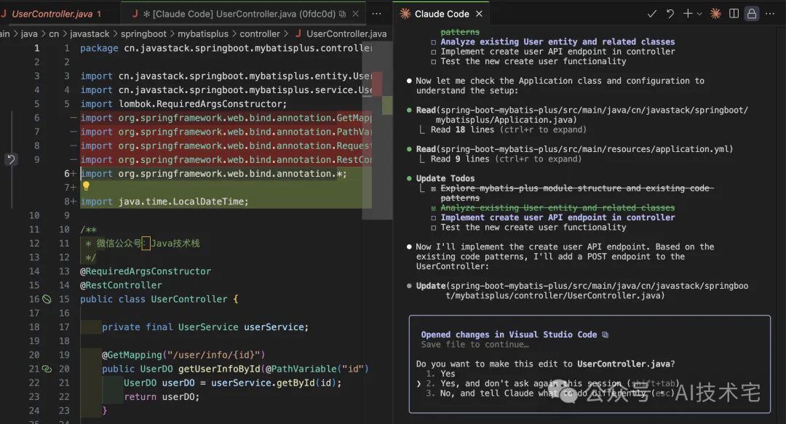

https://docs.anthropic.com/en/docs/claude-code/overview

2025/7/15 05:08 

https://github.com/anthropics/claude-code

未完待续,Claude Code 的强大远不止如此。。

接下来会继续分享下 Claude Code 心得体验、高级使用技巧, 公众号持续分享 AI 实战干货, 关 注「**AI技术宅**」公众号和我一起学 AI。

**版权声明:** 本文系公众号 "AI技术宅" 原创,转载、引用本文内容请注明出处,抄袭、洗稿一律投 诉侵权,后果自负,并保留追究其法律责任的权利。

 $<$  END  $>$ 

#### **推荐阅读:**

[DeepSeek-R1 本地部署硬件配置清单](https://mp.weixin.qq.com/s?__biz=MzU0OTc0NzAxMg==&mid=2247485146&idx=1&sn=31c3e5a70247c5e18a94e2b64f1329e3&scene=21#wechat_redirect)

[DeepSeek-R1 本地部署实战教程来了](https://mp.weixin.qq.com/s?__biz=MzU0OTc0NzAxMg==&mid=2247485186&idx=1&sn=0bb984e6673b1016c3962be2734f1ca6&scene=21#wechat_redirect)

[DeepSeek R1 造本地 AI 知识库,太香了!](https://mp.weixin.qq.com/s?__biz=MzU0OTc0NzAxMg==&mid=2247485346&idx=1&sn=37bc0fadcb75082f24a17b468c3c7f9c&scene=21#wechat_redirect)

[62 个 DeepSeek 万能提示词\(建议收藏\)](https://mp.weixin.qq.com/s?__biz=MzU0OTc0NzAxMg==&mid=2247485283&idx=1&sn=39a1b29436223b99135c1dbe4a542163&scene=21#wechat_redirect)

33k+ star! 全网精选的 MCP 一网打尽!

[MCP 是什么?如何使用?一文讲清楚!](https://mp.weixin.qq.com/s?__biz=MzU0OTc0NzAxMg==&mid=2247485364&idx=1&sn=aede8d79ed5da929a49440b862f84b39&scene=21#wechat_redirect)

更多 ↓↓↓ 关注公众号 ✔ 标星☆ 哦

#### AI技术宅

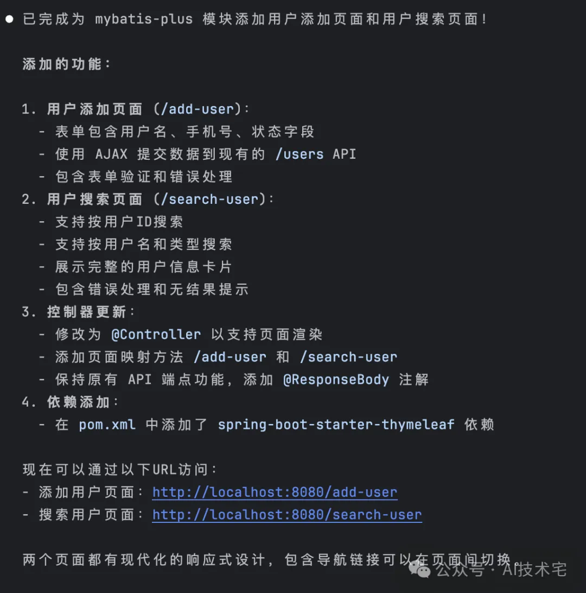

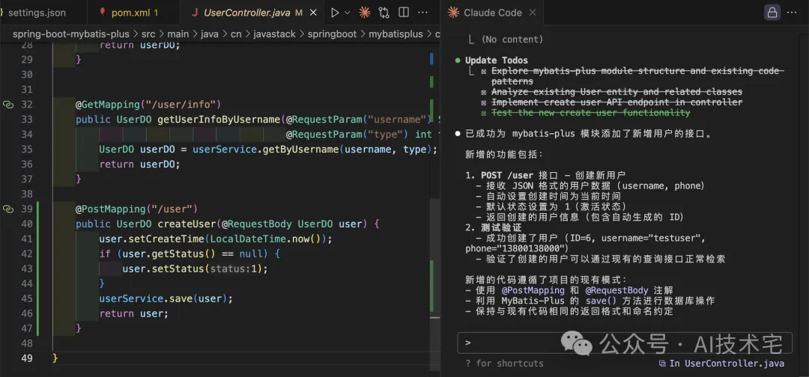

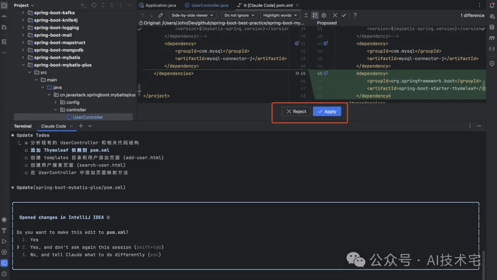

专注分享 AI 大模型、AI 应用实践、AI 工具、AI 编程、AI 最新资讯和玩法、DeepSeek … 18篇原创内容

公众号

修改于2025年07月12日